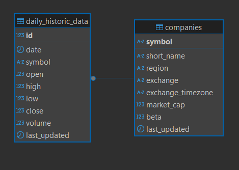
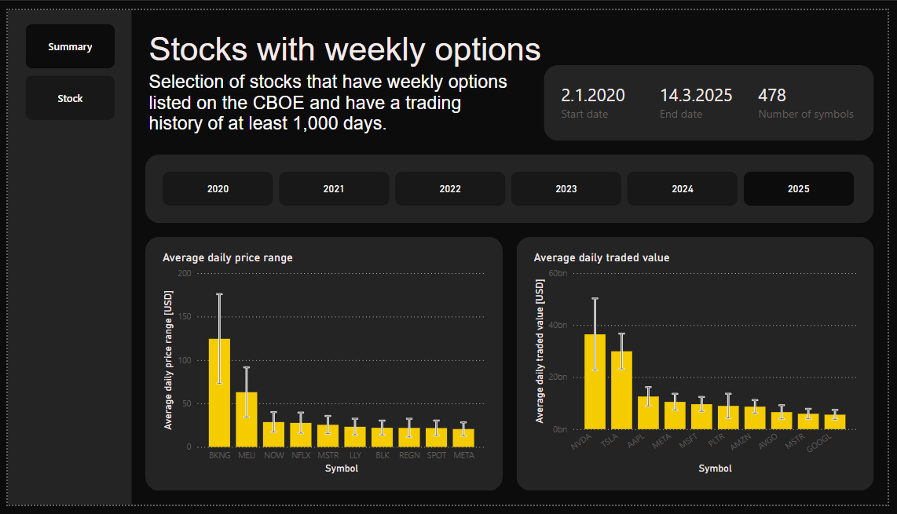
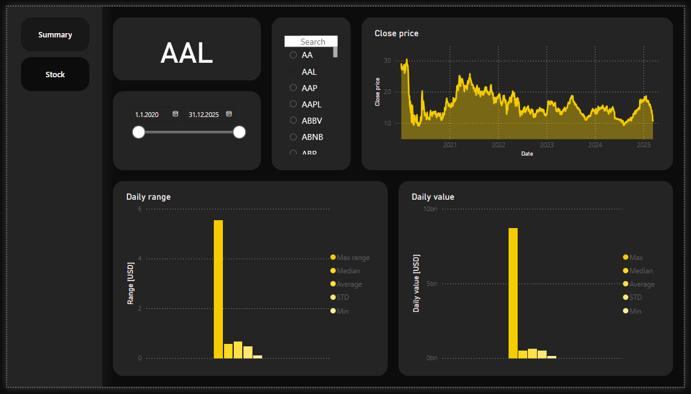

## Stock report
 
 ### About

I love trading with options, and that’s why I was curious to see how selected stocks behaved over a given time period. The stocks had to have [weekly options](https://www.cboe.com/us/options/symboldir/weeklys_options/) available and at least 1000 days of historical data.

I focused on the following metrics:
* daily price range
* daily traded dollar volume

For both metrics, I analyzed:
* the min and max value
* the average
* the median
* the standard deviation

These metrics were visualized in the Power BI dashboard.

#### Project Features

- Power Bi dashboard
- Sql tables
- Data fetch from two sources Polygon.io and Yahoo Finance

### Scheme 

    

### Dashboard

    

    

